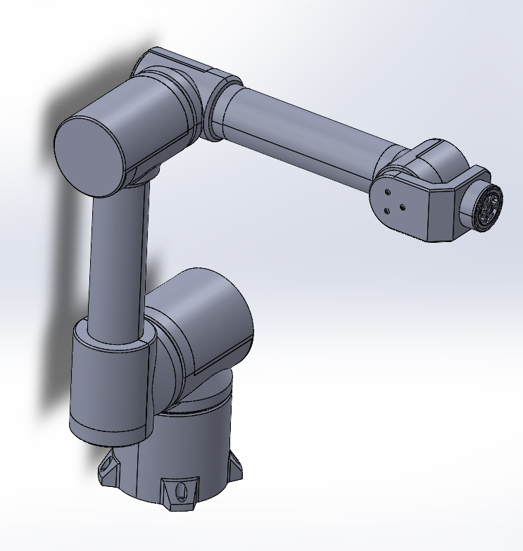

## 🐣 HexaArm MINI: The Desktop Educator

  

    
    

### **Open Hardware Educational Manipulator**
>
> HexaArm Mini is a fully open-source desktop robot designed for universities and STEM education. Unlike toys, it runs on the same **HexaMotion** kernel as our industrial line, providing a real engineering experience in a compact form factor.

#### 🚧 Status: COMING SOON (Q1 2026)
*We are currently finalizing the BOM and documentation for the public release. Star this repo to get notified!*

---

#### 📐 Specifications
| Feature | Spec |
| :--- | :--- |
| **Payload** | ~0.5 kg |
| **Reach** | 600 mm |
| **Architecture** | 6-DOF / All-in-One Design |
| **Controller** | Embedded (x86 Mini-PC + Driver Shield) |
| **Manufacturing** | 3D Printed Covers + Aluminum Tube |

#### 📂 Repository Contents (Roadmap)

This repository serves as a complete "Kit" containing both mechanics and electronics:

#### `/mechanical`
*   **STL Files:** Ready-to-print covers and structural parts.
*   **STEP Assembly:** Full CAD source for modification.
*   **BOM:** Bill of Materials (Bearings, Belts, Fasteners).

#### `/electronics`
*   **Carrier Board:** Schematics and Gerbers for the custom shield (connects Mini-PC to drivers).
*   **Wiring Guide:** Internal cable management and pinout.

---

### 🔗 Ecosystem Links
*   🧠 **Software Core:** [hexa-motion](https://github.com/HexaKinetica/HexaMotion_) (Runs inside this robot).
*   🎮 **Control UI:** [HexaStudio](https://github.com/HexaKinetica/HexaStudio_).

---

**[HexaKinetica.com](https://hexakinetica.com)**
