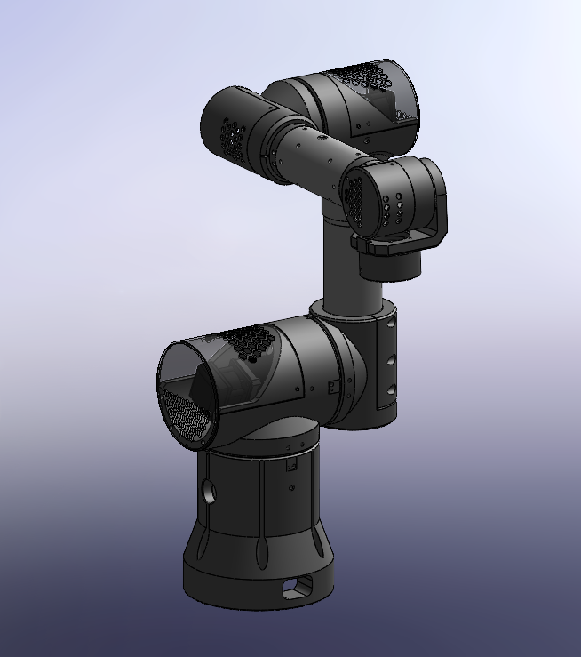

## HexaArm Mini (Maker line): Open Hardware Desktop Manipulator

#### Open-source desktop robotic arm built around a 3D-printable mechanical structure, CAN-based communication, and a hardware layout intended for practical assembly, testing, and iteration.

    
    
    

 

  

---

## Overview

HexaArm Mini was first released in Q1 2026 as a compact open-source desktop robot platform based on a 3D-printable mechanical design, Steadywin motors, and CAN-based communication.

Since that initial release, the design has gone through multiple mechanical and electrical changes. As a result, the current hardware no longer fully matches the original revision published in this repository.

---

## Version 2

Current repository reflects the current direction of the HexaArm Mini platform.

The main changes in this version include a transition to more accessible stepper motors with MKS drivers, a transition to harmonic reducers, a reinforced base, and a slightly optimized overall mechanical layout. These changes were made to simplify the hardware stack, improve the structure of the platform, and make further iteration more practical.

Depending on the task, the working area can be adjusted by changing the link lengths. In its current form, the manipulator can be printed on a 200 × 200 × 250 mm 3D printer.

The image shown in this repository reflects the current version, and the CAD model is provided in STEP format.

---

## Specifications

| Feature | Spec |
| :--- | :--- |
| **Architecture** | 6-DOF |
| **Communication** | CAN |
| **Manufacturing** | 3D Printed |
| **Print Volume Requirement** | 200 × 200 × 250 mm |
| **Workspace** | 600mm by default, adjustable through link-length customization |
| **CAD Format** | STEP / 3mf |

> Note: some parameters differ between the original Q1 2026 release and the current version 2 design.

---

## Repository Contents

### `/HAMM_3D_print`
3D-printable parts for the current hardware version.

### `/HAMM_BOM`
Bill of materials for the platform.

### `/HAMM_CAD`
Main CAD files for the project.

### `/HAMM_CAD_light`
Reduced or simplified CAD package for easier handling.

### `/HAMM_docs`
Project documentation and supporting notes.

### `/HAMM_URDF`
Robot description files for software integration, visualization, and simulation workflows.

---

### 🔗 Ecosystem Links
*   **Software Core:** [hexa-motion](https://github.com/HexaKinetica/HexaMotion) (Runs inside this robot).
*   **Control UI:** [HexaStudio](https://github.com/HexaKinetica/HexaStudio).

---

## License

This project is released under:
- **AGPL-3.0** for software-related content
- **CC BY-SA 4.0** for applicable open hardware and documentation content

See the license files in the repository for details.

**[Hexakinetica.com](https://hexakinetica.com)**
