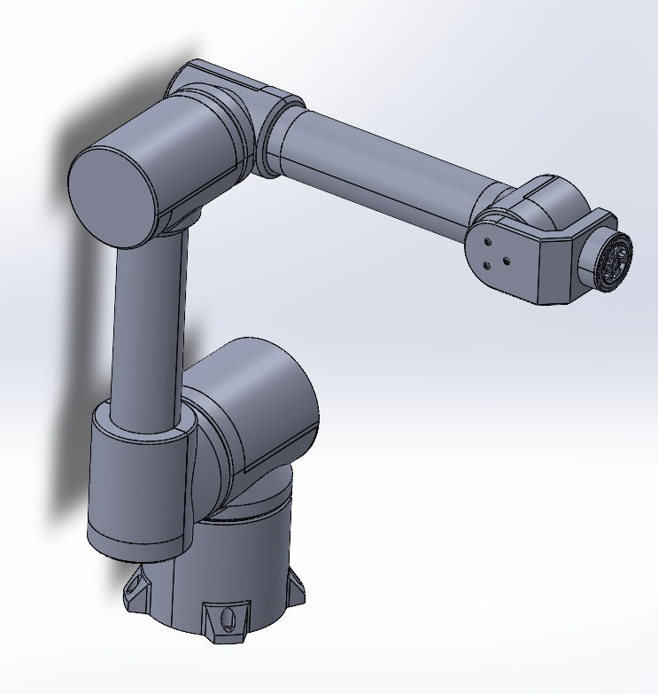

## HexaArm Mini (Maker line): Open Hardware Desktop Manipulator

#### Open-source desktop robotic arm built around a 3D-printable mechanical structure, Steadywin motors, and CAN-based communication.

    
    
    

  

#### Status: Released in Q1 2026

HexaArm Mini was first released in Q1 2026 as a compact open-source robot platform intended for practical assembly, testing, and iterative development. The original version was based on a 3D-printable mechanical design and a CAN-connected actuator setup using Steadywin motors.

Since that initial release, the design has gone through multiple mechanical and electrical changes. As a result, the current hardware no longer fully matches the original revision published in this repository.

This repository is preserved as a reference for the earlier version, including its design approach, hardware layout, and release state at the time. Active development and ongoing support are now focused on version 2.

---

#### 📐 Specifications
| Feature | Spec |
| :--- | :--- |
| **Payload** | ~0.5 kg |
| **Reach** | 600 mm |
| **Architecture** | 6-DOF / All-in-One Design |
| **Controller** | Embedded (x86 Mini-PC + USB-CAN) |
| **Manufacturing** | 3D Printed |

#### 📂 Repository Contents (Roadmap)

#### `/mechanical`
*   **STL Files:** Ready-to-print covers and structural parts.
*   **STEP Assembly:** Full CAD source for modification.
*   **BOM:** Bill of Materials (Bearings, Belts, Fasteners).

---

### 🔗 Ecosystem Links
*   🧠 **Software Core:** [hexa-motion](https://github.com/HexaKinetica/HexaMotion_) (Runs inside this robot).
*   🎮 **Control UI:** [HexaStudio](https://github.com/HexaKinetica/HexaStudio_).

---

**[HexaKinetica.com](https://hexakinetica.com)**
